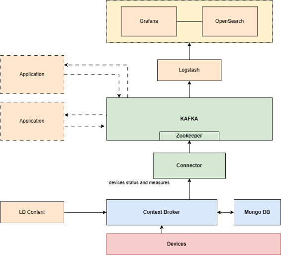
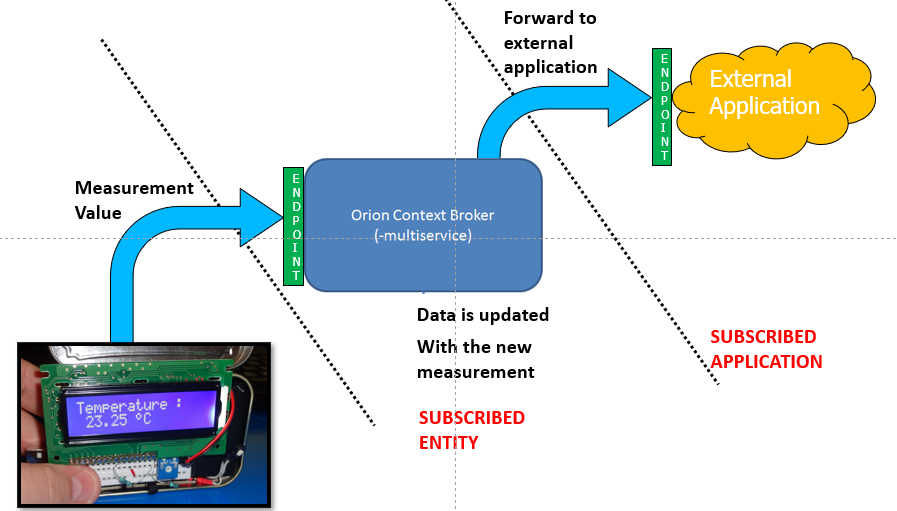
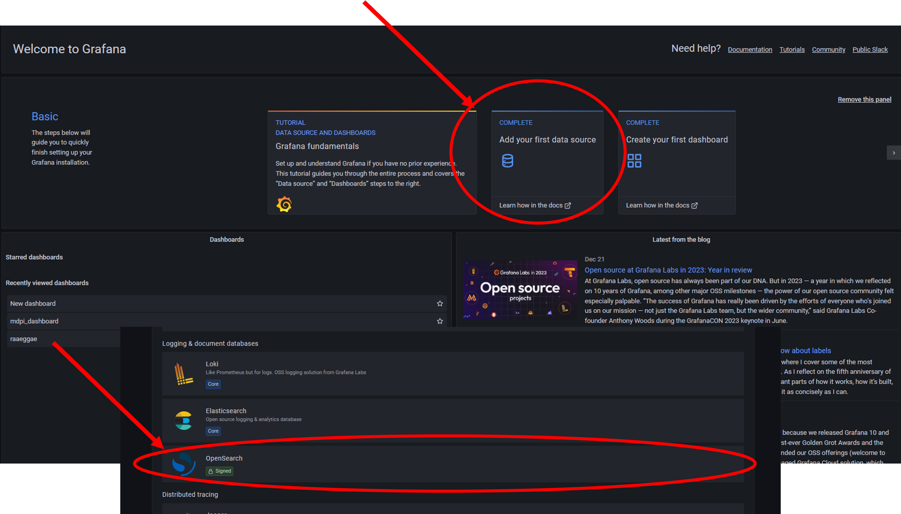
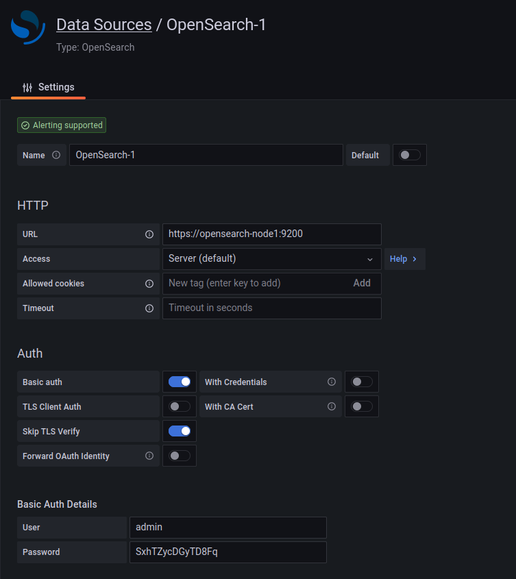
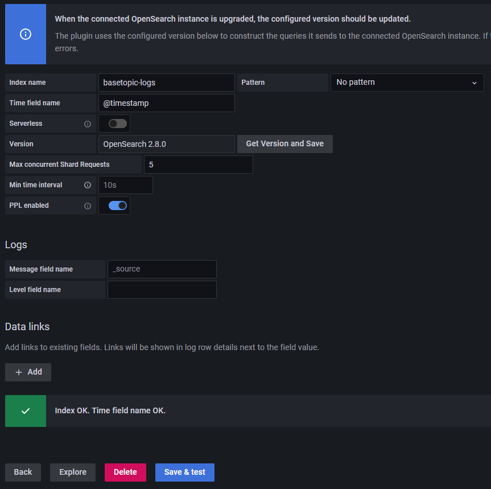
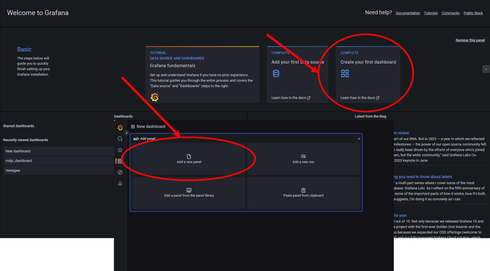
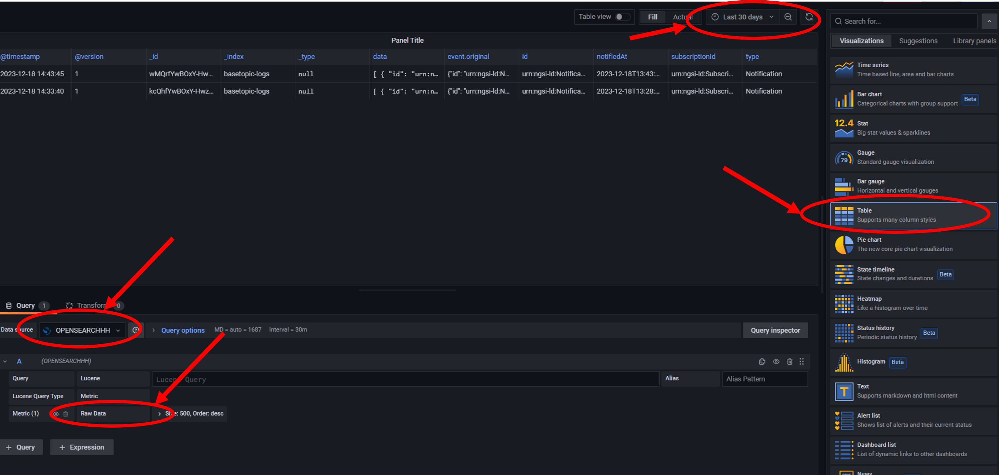
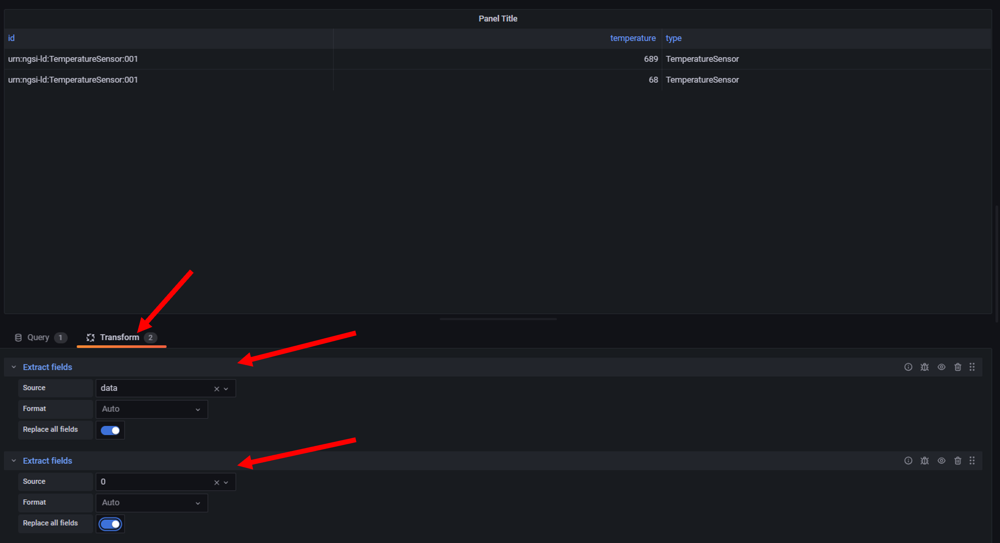

# Building Your Own Security Testbed with FIWARE

## Description
This repository enables users to set up an environment for building a security testbed with a digital twin via FIWARE. It integrates technologies like Orion Context Broker, from FIWARE, KAFKA and OpenSearch, offering a streamlined setup process through Docker Compose. This testbed is ideal for experimenting with security scenarios in a controlled, customizable setting.

## Table of Contents
- [Requisites](#Requisites)
- [Usage](#usage)
- [License](#license)
- [Contact](#contact)

### Requisites

#### **Environment**
It is not mandatory but highly recommended to use a x86 system architecture.


#### **Docker and Docker Compose**
Follow these detailed instructions to install Docker and Docker Compose on your machine:
- **Docker**: [Docker Installation Guide](https://www.docker.com/get-started)
- **Docker Compose**: [Docker Compose Installation Guide](https://docs.docker.com/compose/install/)

To check if Docker Compose is installed:
```shell
docker compose --version
```
#### **Basic Knowledge of FIWARE Smart Data Models**
FIWARE smart data models provide a standardized framework, allowing data interoperability across diverse applications. They establish a common ground for various entities and systems to communicate seamlessly.

A smart data model comprises four key elements. These include the schema, defining technical data types and structure; a written document specifying details; a URI with a functional URL offering basic information about the attribute or entity; and payload examples for both NGSIv2 and NGSI-LD versions.

For more information, please refere to the following documentation:
- FIWARE smart data model principles and general guidelines -> `https://fiware-datamodels.readthedocs.io/en/stable/howto/index.html/`
- NGSIv2 vs NGSI-LD ->  `https://fiware-datamodels.readthedocs.io/en/stable/ngsi-ld_howto/`


### Setting up the Environment
Clone the repository and navigate to the directory:
```shell
git clone https://github.com/FITNESS-Research-Lab/FIWARE_SecurityTestbed.git
cd FIWARE_SecurityTestbed
```

## Usage
Here's how to get started with the testbed:
1. **Starting the Testbed**: In the project folder, run the following command:
   ```shell
   docker compose up -d
   ```

   In case of Openseaerch will Exit, you may need to add ```vm.max_map_count=262144``` in your ***/etc/sysctl.conf*** and run:

   ```bash
   sudo sysctl -p
   ```

   This command starts all the services defined in the Docker Compose file. In particular, the full architecture deployed is the following:
   


    1. **Devices**: The base of the architecture, these are the hardware components or sensors deployed in the field that generate data such as measurements and status updates.

    2. **Context Broker (Orion)**: At the core of the FIWARE platform, the Orion Context Broker aggregates data from the devices and maintains the current system state or "context." It enables the creation of a digital twin by reflecting the real-time status of the devices digitally.

    3. **KAFKA**: Acting as the central data bus, KAFKA manages the stream of data updates from the Context Broker. It decouples the production of data from its consumption, enabling flexibility and scalability in processing and analyzing data streams.

    4. **Zookeeper**: This service coordinates and manages the KAFKA cluster, ensuring that the data streams are stable and reliable.

    5. **Connector**: This serves as a bridge between the Orion Context Broker and KAFKA, formatting and directing the flow of device data onto the KAFKA bus.

    6. **External Applications**: These can be analytics tools, other services, or applications that consume data from KAFKA topics, process it, and potentially take actions or provide insights.

    7. **Logstash**: A data processing component that ingests data from KAFKA, processes it as needed, and then forwards it to OpenSearch.

    8. **OpenSearch**: A powerful search and analytics engine used to index, search, and analyze the data for insights. It facilitates quick data retrieval and real-time analysis.

    9. **Grafana**: A tool for data visualization and monitoring, which connects to OpenSearch to create dashboards that graphically represent the data analytics results.

    Devices produce data that is managed by the Orion Context Broker, which then updates the KAFKA bus through subscriptions,  a subscription in this context is a mechanism by which the Context Broker can notify other components when changes occur. For example, when a device updates its status, the Context Broker can inform other interested parties (like analytics tools or databases) about this change. External applications consume this data for further processing, analysis, or visualization, using tools like OpenSearch and Grafana.

2. **Accessing Services**: 
It is possible to access some services reaching the following links:
   - Grafana dashboard is available at `http://localhost:3000/`
   - OpenSearch is available at `http://localhost:9200/`

   To handle the interaction with the Orion Context Broker and to build the digital twin please refere to the following links:
   - Orion-LD Reference Material at `https://ngsi-ld-tutorials.readthedocs.io/en/latest/ngsi-ld-operations.html`
   - Understanding Subscription Methods at `https://github.com/FIWARE/tutorials.LD-Subscriptions-Registrations`

   To understand the Kafka publish-subscribe mechanism following the link below:
   - Kafka Refrence Material at `https://www.confluent.io/learn/publish-subscribe/`
   
   In this repository, you will not find any device simulator, we strongly recommend to build your own simulated environment.

## Getting Started
In this guide you will be able to build your own security testbed with a simplified example. In particular:

- You will understand the concept of FIWARE smart data models

- You will set up your digital twin

- You will create a simple dashboard for visualizating devices measurements

### Entities Management in Orion Context Broker

The first entity that we are going to create is a temperature sensor. This can be done using a simple POST http requesto to Orion Context Broker:

```shell
   curl --location 'http://localhost:1026/ngsi-ld/v1/entities/' \
--header 'Content-Type: application/json' \
--header 'Link: <http://context/ngsi-context.jsonld>; rel="http://www.w3.org/ns/json-ld#context"; type="application/ld+json"' \
--header 'Ngsild-Tenant: basetopic' \
--data '{
    "id": "urn:ngsi-ld:TemperatureSensor:001",
    "type": "TemperatureSensor",
    "category": {
        "type": "Property",
        "value": "sensor"
    },
    "temperature": {
        "type": "Property",
        "value": 25,
        "unitCode": "CEL"
    }
}'

   ```

We can retrieve the entity that has been created using a GET http request:

```shell
curl --location 'http://localhost:1026/ngsi-ld/v1/entities/urn:ngsi-ld:TemperatureSensor:001' \
--header 'Link: <http://context/ngsi-context.jsonld>; rel="http://www.w3.org/ns/json-ld#context"; type="application/ld+json"' \
--header 'Ngsild-Tenant: basetopic'

   ```


Now that we have the entity, we want to be able to modify values of the sensor, simulating a change in the measurament values, we can do this with a PATCH http reuqest:

```shell
curl --location --request PATCH 'http://localhost:1026/ngsi-ld/v1/entities/urn:ngsi-ld:TemperatureSensor:001/attrs' \
--header 'Content-Type: application/json' \
--header 'Link: <http://context/ngsi-context.jsonld>; rel="http://www.w3.org/ns/json-ld#context"; type="application/ld+json"' \
--header 'Ngsild-Tenant: basetopic' \
--data '{
    "temperature": {
        "type": "Property",
        "value": 689,
        "unitCode": "CEL"
    }
}'

   ```
The next step is to model the subscription for the particular device, this allow the notified values to be sent (with relevant information attached) to a particular endpoint. In this tutorial we don't care about the endpoint because we will utilize the connector endpoint after for sending all the values to the kafka broker.

For setting the subscription:


```shell
curl --location 'http://localhost:1026/ngsi-ld/v1/subscriptions' \
--header 'Content-Type: application/json' \
--header 'Link: <http://context/ngsi-context.jsonld>; rel="http://www.w3.org/ns/json-ld#context"; type="application/ld+json"' \
--header 'Ngsild-Tenant: basetopic' \
--data '{
  "description": "notification_test",
  "type": "Subscription",
  "entities": [{"type": "TemperatureSensor"}],
  "watchedAttributes": ["temperature"],
  "notification": {
    "attributes": ["temperature"],
    "format": "keyValues",
    "endpoint": {
      "uri": "http://10.113.29.69:2020/forward",
      "accept": "application/json"
    }
  }
}'

   ```

For Updating the endpoint of the subscriptions with the endpoint of the connector:

   ```shell
curl --location 'http://localhost:2020/UpdateSub'

   ```

The process can be represented as:




### Enabling Grafana Visualization trough OpenSearch
After setting up the digital twin, it's time to create a simple dashboard to enable the visualization of measurements captured by the devices.
To do this, you can use Grafana. (Click on this link http://localhost:3000)

Once you have clicked on the link, you will need to proceed with authentication. Please insert the following credentials:

Username: admin

Password: admin

When you open Grafana, follow these steps to use OpenSearch.
1. Add your first datasource;
2. Search and click on OpenSearch.



Now, you are ready for set your First Data Source.
Please, follow these instructions.





After that, you can create your dashboard.
To do this, click on "Create your first dashboard", and go to "Add a new panel".



You are quite ready.
You have to change somethings:
1. Filter only data from the last few days.
2. Change your visualization, and switch to "Table".
3. After, click on Query and among metrics, choose "Raw Data".
4. In Trasform, add "Extract fields", like follows.






## License
You are welcome to utilize and share this repository. If you find this repository valuable for your research, please consider referencing the following paper, which incorporates insights from this testbed:

[COPPOLINO, Luigi, et al. "Building Cyber-Resilient Smart Grids with Digital Twins and Data Spaces." Applied Sciences, 2023, 13.24: 13060.]

Read the paper at: [Building Cyber-Resilient Smart Grids with Digital Twins and Data Spaces](https://www.mdpi.com/2076-3417/13/24/13060)


## Contact
For any queries or further information, please contact FITNESS Lab:

`http://www.fitnesslab.eu/`

---